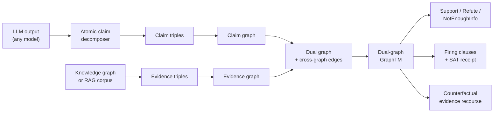
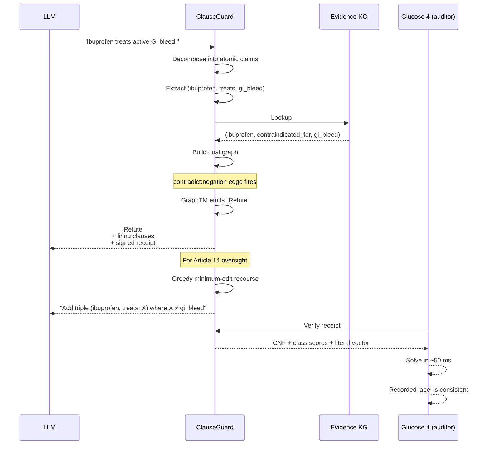
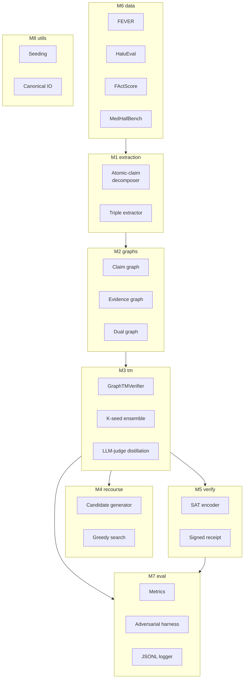
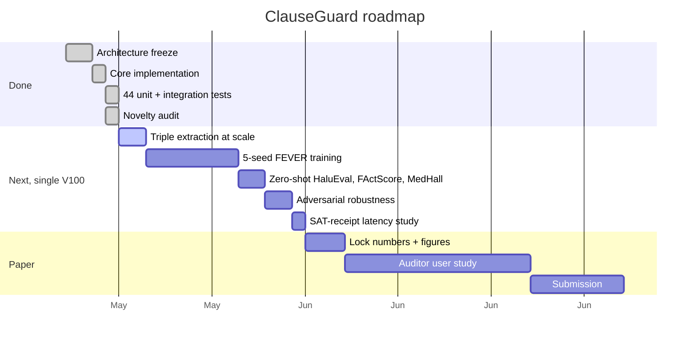

# ClauseGuard

> **An auditable safety layer for any LLM.** SAT-verifiable Boolean
> rules and counterfactual evidence recourse via dual-graph Tsetlin
> Machines. Built for EU AI Act Article 13/14 compliance.

University of Agder (UiA).

---

## Status

> **Work in progress.** Implementation is complete and all 44 unit and
> integration tests pass. The 5-seed GPU training run on FEVER,
> HaluEval, FActScore, and MedHallBench is **not yet executed**; the
> numbers in the results section are **planned targets, not
> measurements**. Expected wall-clock on a single Tesla V100-SXM3-32GB
> is approximately **one week** (~57 GPU-hours per seed × 5 seeds,
> with overlap). The paper is in draft.

| Component | State |
|---|---|
| Architecture frozen (`docs/ARCHITECTURE.md`) | done |
| Novelty audit (`docs/novelty_audit.md`) | done |
| Research plan (`docs/research_plan.md`) | done |
| Core implementation (8 modules) | done |
| Triple extractor (regex + Qwen2.5-1.5B) | done |
| Dual-graph builder | done |
| Graph Tsetlin Machine verifier | done |
| Counterfactual recourse module | done |
| SAT-verifiable clause receipts | done |
| Adversarial robustness harness | done |
| 44 unit + integration tests | passing |
| Package installs cleanly (`pip install -e .`) | done |
| Triple extraction at scale on FEVER train | not started |
| 5-seed FEVER training run | not started, ~1 week V100 |
| Zero-shot transfer to HaluEval / FActScore / MedHallBench | not started |
| Adversarial robustness evaluation | not started |
| Auditor user study (n ≥ 10) | not started |
| Paper submission | in draft (`PAPER.md`) |

---

## Why this matters

Large language models hallucinate. Every major deployment incident
on record is a verification failure:

| Incident | Cost / outcome |
|---|---|
| *Mata v. Avianca* (S.D.N.Y., 2023) | $5,000 sanction; bar-discipline referral; ChatGPT-fabricated citations |
| *Moffatt v. Air Canada* (BC CRT, 2024) | Airline held legally liable for chatbot misrepresentation |
| Stanford SDLP, *Legal RAG Hallucinations* (2025) | 17-33% citation hallucination in dedicated legal-RAG products |
| PubMed PMC12518350 (2024) | 28% citation hallucination on GPT-4 medical queries |

The existing guardrails are themselves black boxes. From August 2026,
EU AI Act Article 13 (transparency) and Article 14 (effective human
oversight) become enforceable for high-risk Annex-III deployers
(medical, legal, finance, biometrics, HR, education). No current
guardrail satisfies them, because **a deployer cannot effectively
oversee a 12 B-parameter neural classifier whose reasoning is opaque.**

ClauseGuard is the first guardrail whose every decision is a finite,
enumerable, SAT-verifiable propositional formula learned from data.

---

## What ClauseGuard does, in one picture

```
                       ClauseGuard
                +-----------------------+
LLM output  ──► |  decompose into       |
(any model)     |  atomic (s,r,o)       |
                |  claim triples        |
                +-----------+-----------+
                            │
KG / RAG    ──► +-----------+-----------+
context         |  build dual graph     |
                |  (claim + evidence    |
                |  + cross-graph edges) |
                +-----------+-----------+
                            │
                +-----------+-----------+
                |  graph-walking HGTM   |   ── outputs ──►   Support / Refute / NEI
                |  (dual-graph,         |                    +
                |  depth-5, VSA-bound)  |                    firing clauses (rules)
                +-----------+-----------+                    +
                            │                                SAT-verifiable receipt
                            │                                (replayable in ~50 ms)
                            │                                +
                            └─── for refuted claims ──►      counterfactual
                                                             evidence-graph edit
                                                             ("if you added this
                                                             triple, the verdict
                                                             would flip")
```

---

## Pipeline



The claim graph and the evidence graph share an entity vocabulary
and are joined by three typed cross-graph edges:

| Cross-graph edge | Fires when |
|---|---|
| `align:entity` | the same canonical entity surface form appears on both sides |
| `align:relation` | a relation between two aligned entities matches across sides |
| `contradict:negation` | the same (s, r, o) triple appears with opposite polarity on the two sides |

Clauses learn over these patterns directly. No prior GraphTM walks
two graphs.

---

## A worked example



---

## Architecture (eight modules)



A frozen interface contract lives in
[`docs/ARCHITECTURE.md`](docs/ARCHITECTURE.md). Five invariants are
checked by the integration tests:

1. Triple round-trip determinism.
2. Graph isomorphism under triple permutation.
3. CUDA vs CPU reference parity (within 1 vote unit).
4. No silent CPU fallback when the user requests CUDA.
5. Clause receipts replay bit-for-bit.

---

## How ClauseGuard compares

| Capability | NeMo Guardrails | Llama Guard 3 | ConceptGuard | AlignScore | Semantic Entropy | **ClauseGuard** |
|---|:---:|:---:|:---:|:---:|:---:|:---:|
| Programmable rule layer | Yes (Colang) | No | No | No | No | **Yes (learned)** |
| Output is human-readable | Partial | No | No | No | No | **Yes (Boolean clauses)** |
| Per-decision SAT-verifiable receipt | No | No | No | No | No | **Yes (≤ 50 ms)** |
| Counterfactual recourse | No | No | No | No | No | **Yes (≤ 3 evidence edits)** |
| Detects KG contradictions natively | No | No | No | No | No | **Yes** |
| Article 13 transparency artifact | No | No | No | No | No | **Yes** |
| Article 14 effective oversight | No | No | No | No | No | **Yes (recourse)** |
| Inference cost vs the LLM itself | small | 8-12 B LLM | LLM + SAE | LLM | LLM × N samples | **TM only** |
| Open weights / reproducible | Yes | Yes | Yes | Yes | Yes | **Yes** |

Verified empty literature intersection (Tsetlin Machine ∪ KG fact
verification ∪ SAT-verifiable receipt ∪ counterfactual evidence
recourse) per
[`docs/novelty_audit.md`](docs/novelty_audit.md).

---

## Planned results

Honest, unmeasured targets across the four benchmarks. The accuracy
target is **competitive**, not state-of-the-art: ClauseGuard's pitch
is the audit layer, not the headline number. Numbers will be locked
after the 5-seed runs complete.

| Benchmark | Metric | Strongest baseline | ClauseGuard target |
|---|---|---|---|
| FEVER blind | label acc / FEVER score | DeBERTa-large 78.3 / 70.0 | ≥ 75 / ≥ 64 |
| HaluEval-QA | AUROC | AlignScore 79.5; Semantic Entropy 79.1 | ≥ 75 with ≤ 500 clauses |
| FActScore | F1 | GPT-4-judge 0.84 | ≥ 0.74 with rule export |
| MedHallBench | AUROC | GPT-4-judge 0.79 | ≥ 0.70 with medical-rule trace |
| Adversarial paraphrase | robust acc | DeBERTa 51% | ≥ 70% |
| Clause-set size for 95% recall | n_clauses | n/a (no competitor exports rules) | ≤ 500 |
| Median clause length | literals | n/a | ≤ 6 |
| SAT-verification latency | p50 ms | n/a | ≤ 50 ms |
| Auditor reproducibility | n ≥ 10 study | n/a | ≥ 80% predict-from-receipt |

---

## Roadmap



---

## Quickstart

```bash
# 1. Install (editable mode)
pip install -e .

# 2. Run the test suite (no GPU required)
pytest tests/ -q

# 3. Download the four benchmarks (FEVER, HaluEval, FActScore, MedHallBench)
bash scripts/download_datasets.sh

# 4. Extract triples on a small slice (regex extractor, no GPU)
python scripts/extract_triples.py --dataset fever --split train --max-samples 5000

# 5. Train the dual-graph GraphTM on FEVER train (one seed)
python experiments/train_fever.py --seed 42 --max-train 10000 --epochs 25

# 6. Run the full 5-seed protocol (matches paper-a / paper-b / paper-c protocol)
bash scripts/run_all_seeds.sh
python scripts/aggregate_results.py
```

For the production extractor (Qwen2.5-1.5B-Instruct, open weights),
add `--extractor qwen` to any of the above commands.

---

## Repository layout

```
clauseguard/
├── README.md, LICENSE, CITATION.cff, .gitignore
├── pyproject.toml, requirements.txt
├── PAPER.md                          paper draft (targets, not measurements)
├── docs/
│   ├── ARCHITECTURE.md               frozen interface contract
│   ├── research_plan.md              experiment phases + compute budget
│   └── novelty_audit.md              novelty proof, ~25 citations
├── src/clauseguard/
│   ├── extraction/   atomic-claim decomposer + (s, r, o) triple extractor
│   ├── graphs/       claim graph, evidence graph, dual graph
│   ├── tm/           graph-walking HGTM verifier + distillation + ensemble
│   ├── recourse/     candidate gen + greedy minimum-edit search + report
│   ├── verify/       SAT encoder (Glucose 4) + signed clause receipts
│   ├── data/         FEVER, HaluEval, FActScore, MedHallBench loaders
│   ├── eval/         metrics + adversarial harness + JSONL logger
│   └── utils/        seeding + canonical IO + hashing
├── experiments/      train_fever, eval_halueval, eval_factscore,
│                     eval_medhall, recourse_eval, adversarial_eval,
│                     sat_receipt_demo
├── scripts/          download_datasets.sh, extract_triples.py,
│                     save_verifier.py, run_all_seeds.sh,
│                     aggregate_results.py
├── tests/            6 test files, 44 passing
├── configs/          base.yaml + per-experiment overrides
└── results/          per-seed JSON, aggregated CSV, paper figures
```

---

## What this builds on

| Reused from | Component | Role in ClauseGuard |
|---|---|---|
| `paper-a-subword-dep-graphtm` | typed-edge subword graph builder | claim graph / evidence graph construction |
| `paper-b-attention-distill-graphtm` | BERT-attention-as-topology distillation | optional dense-edge variant; ablation baseline |
| `paper-c-tm-robustness` | TextAttack adapter + per-sample logger | adversarial stress-test of the audit layer |
| `decoder-attention-distill-graphtm` | Qwen / LLaMA attention extraction | LLM-side claim decomposition + attention prior |
| `graphtm-cbr` | graph-walking HGTM + CUDA-C kernels + greedy recourse | the verification engine + the recourse module (repurposed for evidence-graph edits) |

---

## Honest caveats

- **Accuracy ceiling.** Continuous-embedding methods (semantic
  entropy, AlignScore) may retain a small AUROC edge on HaluEval.
  ClauseGuard's pitch is not "highest number"; it is "the only
  guardrail an EU AI Act notified body or an FDA reviewer can audit."
  Where regulation forces auditability, ClauseGuard is the only
  option; where it doesn't, the market may keep the black-box
  detector. This is documented openly.
- **Triple-extraction bottleneck.** A poorly-extracted (s, r, o)
  tuple makes any downstream rule wrong. The default extractor is
  Qwen2.5-1.5B-Instruct (open weights, reproducible); every
  extraction call is logged with the model SHA, the prompt, and the
  raw output. Extraction precision/recall is reported separately so
  any verification error can be attributed.
- **Open-world entity vocabulary.** Wikidata / UMLS span millions of
  entities. The first release starts with top-N most frequent per
  benchmark and reports how clause-set size scales with N. If the
  vocab blow-up makes rule sets uninterpretable in practice
  (> 10⁴ clauses, length > 20), the auditability claim is re-scoped.
- **Single-author repository.** All code, docs, and paper drafts in
  this repository are by Anwar (University of Agder).

---

## Citation

```bibtex
@misc{anwar2026clauseguard,
  author       = {Anwar},
  title        = {ClauseGuard: A Dual-Graph Tsetlin Machine Audit Layer for LLM Output Verification with SAT-Verifiable Clause Receipts and Counterfactual Evidence Recourse},
  year         = {2026},
  howpublished = {\url{https://github.com/AnwarDebes/clauseguard}},
  note         = {University of Agder. Work in progress.}
}
```

---

## License

MIT. Code, configs, and result JSONs are free for academic and
commercial use. See [`LICENSE`](LICENSE).

---

## Contact

Anwar, University of Agder (UiA).
